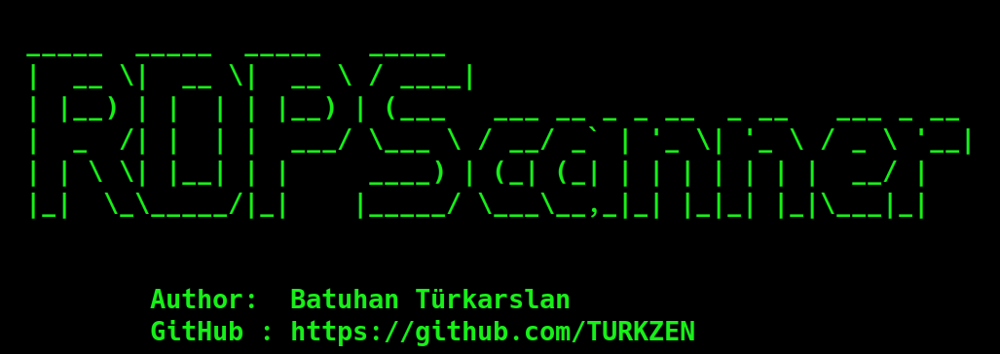

<h2 align="center"><u>RDP Scanner Tool</u></h2>

 
    
    
    
    
    

### [+] Description
RDP Scanner scans all open RDPs in the network and saves time.

### [+] Installation
 - `git clone https://github.com/TURKZEN/RDPScanner`

### [+] Usage
 - `cd RDPScan`
 - `python3 RDPScanner.py`

### [+] Credits 
 TURKZEN

### [+] Find me on 

